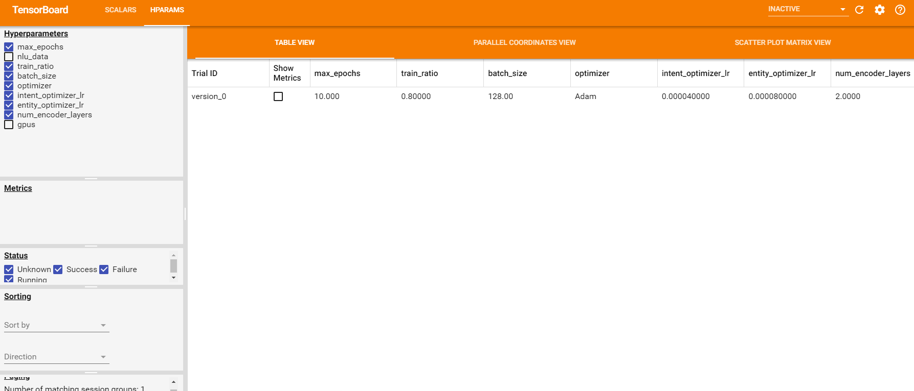

# DIET-pytorch
Dual Intent Entity Transformer Pytorch version

It is implemented [pytorch-lightning](https://github.com/PyTorchLightning/pytorch-lightning) based module

## How to train
---
1. Training 

    ```
    from DIET import trainer

    trainer.train(
        file_path,

        #training args
        train_ratio=0.8,
        batch_size=32,
        optimizer="Adam",
        intent_optimizer_lr=1e-5,
        entity_optimizer_lr=2e-5,
        checkpoint_path=os.getcwd(),
        max_epochs=10,

        #model args
        num_encoder_layers=3,
        **kwargs
    )
    ```

    file_path indicate markdown format NLU dataset which follow below [RASA NLU training data format](https://rasa.com/docs/rasa/nlu/training-data-format/#markdown-format)

    All parameters in trainer including kwargs saved as a modeel hparams

    User can check these paramters via checkpoint tensorboard logs
    

2. Inference

    ```
    from DIET import Inferencer

    inferencer = Inferencer(checkpoint_path)
    inferencer.inference(text: str, intent_topk=5)
    ```

    As this repository model is implemented based on pytorch-lightning, it generate checkpoint file automatically(user can set checkpoint path in training step)

    After setting checkpoint path, query text to inferencer. Result contain intent_rank, user can set n-th rank confidences of intents.

    Inference result will be like below
    ```
    {
        "text": "오늘 서울 날씨 어때?",
        "intent": {
            "confidence": 0.6323,
            "name": "ask_weather"
        },
        "intent_ranking": [
            {
                "confidence": 0.6323,
                "name": "ask_weather"
            },
            ...
        ],
        "entities": [
            {
                "start": 3,
                "end": 4,
                "value": "서울",
                "entity": "location"
            },
            ...
        ]
    }
    ```

## How it works
---

The model in this repository refered from Rasa DIET classifier.

[this blog ](https://ryanong.co.uk/2020/04/10/day-101-in-depth-study-of-rasas-diet-architecture/) explain how it works in Rasa framework.

But more simple implementation & fast training, inference,
There are several changes int here.

1. There is no CRF layer ahead TransformerEncoder layer

    In real training situation, CRF training pipeline takes a lot of training time. But it can not sure CRF model really learn token relation well or it really need(I guess transformer self-attention do similar things)

2. It takes character tokenzier for enhancing korean language parsing. 

    Differ from English or other languages. Korean's character can be joined or splitted in character themselves. Considering this feature, I applied character based tokenizer

3. There is no mask loss.

    Relating upper difference, it doesn't use any pre-trained embedding and tokenizer. So masking techinique is hard to apply.


